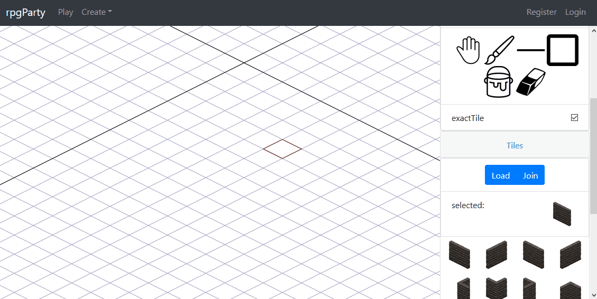

# rpgParty
MEAN Stack multiplayer rpg

[Live Demo](https://dharrsnprojects.com/rpgparty/home)

Welcome to rpgParty. Create a room on your home television to begin a quest. Have yourself and your friends join in to control and play as their own characters on their mobile devices.
# Screenshots
### Map Editor

### Join Room

### Tileset Editor

### Demo

# Instructions
1. Install MongoDB, Node, and Angular cli
2. Start MongoDB on port 27017
3. In rpgParty root directory, run npm install
4. In rpgParty root directory, run node index.js
5. In rpgParty root/client directory, run npm install
6. In rpgParty root/client directory, run ng serve
7. Open browser to localhost:4200
